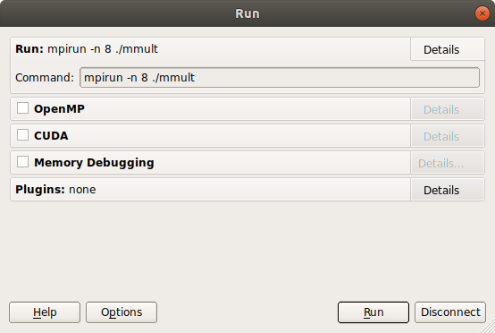
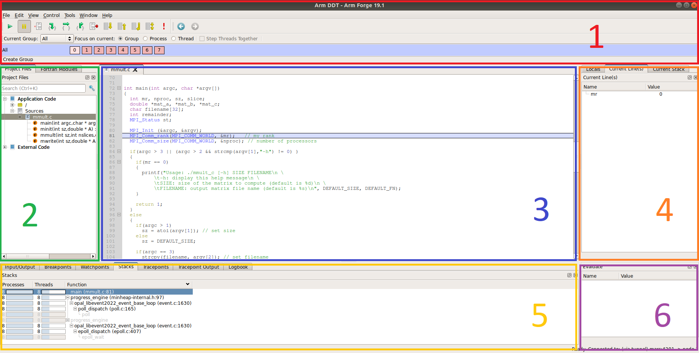
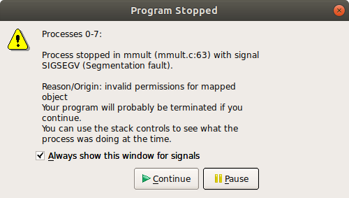
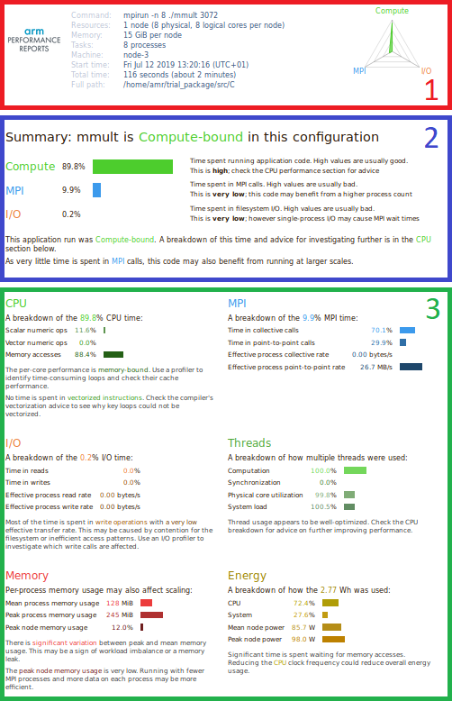
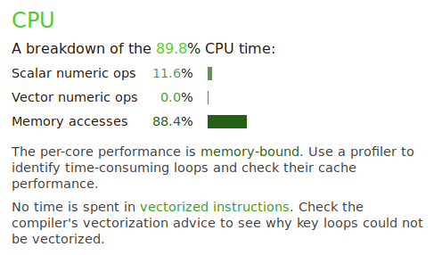
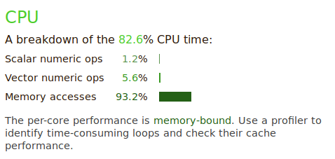
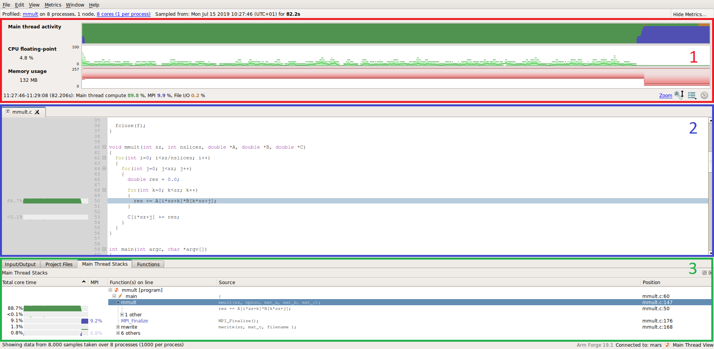
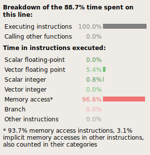
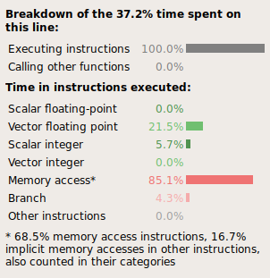

.. Arm logo and link to hpc page

Thank you for requesting a trial license of Arm HPC tools. This package contains a tutorial with example codes in C/C++, Fortran and Python that will demonstrate:

- how to fix crashes in parallel applications,
- how to identify performance issues and optimize them.

The trial license allows you to evaluate the following tools:

- `Arm Forge <https://www.arm.com/products/development-tools/server-and-hpc/forge>`_ on any HPC architecture and all features included. Arm Forge includes **Arm DDT** for debugging, **Arm MAP** for profiling and **Arm Performance Report** for performance analysis.
- `Arm Allinea Studio <https://www.arm.com/products/development-tools/server-and-hpc/allinea-studio>`_ for Arm-based systems. Arm Allinea Studio includes Arm Forge, Arm Performance Reports, **Arm Compiler for Linux** (for C/C++ and Fortran) and **Arm Performance Libraries**.

.. Table of content
.. contents::

============================
Description of the algorithm
============================

The application used for this tutorial performs the following calculation:

.. math::
  C = A \times B + C

where A, B and C are double-precision square matrices. In this first version, the algorithm is written in parallel using MPI and includes one master process and several worker processes. The following tasks are performed:

- The master process initializes matrices A, B and C
- The master process sends the whole matrix B along with slices of A and C to the worker processes
- The master and worker processes perform the matrix multiplication function on the domain that has been given to them and everyone computes a slice of C
- The master process retrieves all slices of C and puts the result matrix C together
- The master process writes the results of C in a file

The picture below illustrates how all processes contribute in parallel to the creation of the result matrix C:

.. table::
   :align: center

   +----------------+---------------------------+
   |Master process  |.. image:: img/master.png  |
   |                |   :height: 100px          |
   +----------------+---------------------------+
   |Worker process 1|.. image:: img/worker_1.png|
   |                |   :height: 100px          |
   +----------------+---------------------------+
   |Worker process N|.. image:: img/worker_n.png|
   |                |   :height: 100px          |
   +----------------+---------------------------+

This package includes C/C++, Fortran and Python version of this application.

=====================
Software requirements
=====================

This tutorial is for Linux platforms only. To build and run the application, make sure that:

* a C/C++ or Fortran compiler is available

  - on Arm-based systems, you can use the `Arm Compiler for Linux <https://developer.arm.com/tools-and-software/server-and-hpc/arm-architecture-tools/arm-allinea-studio/download>`_. The trial license you have requested allow you to use the software and can be copied in ``/opt/arm/licenses`` by default.

* a MPI environment is configured,

* a BLAS library is installed

  - on Arm-based platforms, you can use the `Arm Performance Libraires <https://developer.arm.com/tools-and-software/server-and-hpc/arm-architecture-tools/arm-performance-libraries>`_ shipped with the Arm Compiler for Linux

* `Arm Forge`_ is installed and loaded in the environment,

  - The trial license can be copied in the ``licenses/`` folder where the tools are installed.

For the Python version:

- Python 3.6
- `MPI4Py 3.0.2 <https://pypi.org/project/mpi4py/>`_, `NumPy 1.16.4 <https://www.numpy.org/>`_ and `SciPy 1.3.0 <https://www.scipy.org/>`_ modules should be installed

.. note::

  If you are using the Arm Compiler for Linux, check our tutorials on how to build `OpenMPI <https://developer.arm.com/tools-and-software/server-and-hpc/arm-architecture-tools/resources/porting-and-tuning/building-openmpi-with-arm-compiler>`_, `MPICH <https://developer.arm.com/tools-and-software/server-and-hpc/arm-architecture-tools/resources/porting-and-tuning/building-mpich-with-arm-compiler-v2>`_, `MVAPICH <https://developer.arm.com/tools-and-software/server-and-hpc/arm-architecture-tools/resources/porting-and-tuning/building-mvapich-with-arm-compiler>`_ or `Numpy <https://developer.arm.com/tools-and-software/server-and-hpc/arm-architecture-tools/resources/porting-and-tuning/building-numpy-with-arm-compiler>`_.

======================
Content of the package
======================

This package contains the following folder and files:

- tutorial.html
- Makefile
- make.def
- **src**

  - **C**

    - *mmult.c*
    - Makefile
  - **F90**

    - *mmult.F90*
    - Makefile
  - **Py**

    - Makefile
    - *mmult.py*

    - **C**

      - *mmult.c*
      - Makefile

    - **F90**

      - *mult.F90*
      - Makefile

================
Compile the code
================

To compile all versions of the application, you can run ``make`` in the ``src`` directory:

``$ cd src``

``$ make``

The ``Makefile`` in this folder relies on the settings of ``make.def`` where the compiler command and compilation options can be changed.

The different versions in C/C++, Fortran can be compiled separately in the ``C`` and ``F90`` folders. The Python version relies on C and F90 kernels that need to be compiled using the ``Makefile`` provided in the ``Py`` folder.

===================
Run the application
===================

To run a specific version, go into the ``C``, ``F90`` or ``Py`` folder where the binary has been compiled. You can run the application using 8 processes with the following command:

``$ mpirun -n 8 ./mmult`` for the ``C`` and ``F90`` versions

``$ mpirun -n 8 python ./mmult.py`` for the ``Py`` version

Additional arguments can be added to change the size of the matrices, for example 512x512:

``$ mpirun -n 8 ./mmult 512`` for the ``C`` and ``F90`` versions

``$ mpirun -n 8 python ./mmult -s 512`` for the ``Py`` version

.. note::
  By default, the ``Py`` version will run the C kernel. To run the F90 kernel instead, use:

  ``$ mpirun -n 8 python ./mmult -k F90``

For additional help, you can run:

``$ ./mmult -h`` for the ``C`` and ``F90`` versions

``$ python ./mmult.py -h`` for the ``Py`` version

When running the source code provided for the first time, the application should crash. This is expected. We are going to fix the bug in the next section.

===========
Fix the bug
===========

To fix the bug, you first need to recompile the application with the debugging flag ``-g``. In order to make debugging more user-friendly, we recommend compiling without compiler optimizations ``-O0``. These options can be changed in ``src/make.def`` to have:

``CFLAGS = -O0 -g``

Remove the initial executable with:

``$ make clean``

And recompile with:

``$ make``

.. note::
  In Fortran, the compiler may display a warning. More information can be displayed at runtime by compiling with the "-fcheck=bounds" flag with GCC or "-Mbounds" with the Arm Compiler for Linux.

To debug the version of your choice, go into the ``C``, ``F90`` or ``Py`` folder where the binary has been compiled. The application crashes at any scale but you can debug it using 8 processes with the following command (express launch):

``$ ddt mpirun -n 8 ./mmult``

``$ ddt mpirun -n 8 python ./mmult.py``

If the express launch is not supported for your MPI environment, you run the following command instead:

``$ ddt -n 8 ./mmult``

``$ ddt -n 8 python ./mmult.py``

The GUI of Arm DDT will start and the *Run window* will be displayed. If you are running on a remote system, make sure X forwarding is enabled.

This window summarizes the settings for the debugging session. Click on *Run* to continue. The debugger's main window will then open.

The interface displays the following:

1. Commands to play, pause or stop the application and select the processes or threads to inspect
2. Project source files
3. Source code view
4. Current line and program variables
5. Stack view and breakpoints/tracepoints/watchpoints settings
6. Evaluate window for arbitrary expressions

.. note::
  At this stage, the ``C`` and ``F90`` version should display the source code of the application. If DDT doesn't, make sure you have compiled with the debugging flag ``-g``.
  For the ``Py`` version, no source code is displayed when the debugger attaches. This is expected when running in the Python interpreter. The C or F90 source code of the kernel when the application crashes if the kernels have been compiled with ``-g``.

To visualize where the application crashes, click on the |play| button in the top-left corner. The debugger will then stop where the application crashes.

Click on *Pause*. The line of code where the crash happens is highlighted in the source code viewer.

``res += A[i*sz+k]*B[k*sz*j];`` in C

``res=A(k,i)*B(j,k+res)`` in F90

Can you see the problems? The expression to compute the index of array B is wrong and results in an out of bound memory access. The bug can be fixed with:

``res += A[i*sz+k]*B[k*sz+j];`` in C

``res=A(k,i)*B(j,k)+res`` in F90

.. note:: 
  Out of bound memory access can be detected automatically by Arm DDT. Tick the "Memory debugging" box in the "Run" window. Go to memory debugging "Details" and enable "Add guard pages to detect out of bound heap accesses" (see our `Section 12 in our user guide <https://developer.arm.com/docs/101136/latest/ddt/memory-debugging#x16-19200012>`_ for more information).

The source file can be saved from the *File* menu and *Save Source File* and recompiled from the *File* menu and *Buid* (by default, this will run ``make`` in the current folder but this can be configured in *Configure Build*).

Run the executable with the fix in the debugger from the *File* menu and *Restart session*. A message will appear asking to restart the application from the beginning. Click on *Yes*.

Play the application in the debugger again. The application will now run without any issues until every process in the program has terminated and output the following when running 8 processes:

::

  0: Size of the matrices: 64x64
  3: Receiving matrices...
  6: Receiving matrices...
  2: Receiving matrices...
  4: Receiving matrices...
  7: Receiving matrices...
  1: Receiving matrices...
  5: Receiving matrices...
  0: Initializing matrices...
  0: Sending matrices...
  1: Processing...
  2: Processing...
  3: Processing...
  4: Processing...
  5: Processing...
  6: Processing...
  7: Processing...
  0: Processing...
  1: Sending result matrix...
  3: Sending result matrix...
  5: Sending result matrix...
  7: Sending result matrix...
  2: Sending result matrix...
  4: Sending result matrix...
  6: Sending result matrix...
  0: Receiving result matrix...
  0: Writing results...
  0: Done.

When fixed, the application will write the results in the working directory, in a file called res_C.mat, res_F90.mat or res_Py.mat depending on the version used. Make sure your working directory is writable.

.. note::
  To run Arm DDT in non-interactive mode, use the following command-line options:

  ``$ ddt --offline mpirun -n 8 ./mmult``

  The debugger will run in the background of the application and output a debugging report:

  ``$ firefox mmult_8p_1n_YYYY-MM-DD_HH-MM.txt``

  YYY-MM-DD_HH-MM corresponds to a timestamp of the report creation date. See `section 15 of our user guide <https://developer.arm.com/docs/101136/latest/ddt/offline-debugging>`_ for more details.

This example crashes when run sequentiall but Arm DDT is a complete parallel debugger. Explore the product features for large-scale debugging in `Useful links`_ section to know more.

=====================
Analyze the behaviour
=====================

Now that the application has been fixed, let's analyze its behaviour and check if there is any performance issue. To do this, **Arm Performance Report** can be used as follows from the on the ``C``, ``F90`` or ``Py`` version. Run the application with 8 processes on a larger test case, for example 3072x3072 matrices:

``$ perf-report mpirun -n 8 ./mmult 3072`` or

``$ perf-report mpirun -n 8 python ./mmult.py -s 3072``

If the express launch is not supported for your MPI environment, run the following command instead:

``$ perf-report -n 8 ./mmult 3072`` or

``$ perf-report -n 8 python ./mmult.py -s 3072``

When the execution terminates, two files are created by Arm Performance Reports:

- mmult_8p_1n_YYYY-MM-DD_HH-MM.txt
- mmult_8p_1n_YYYY-MM-DD_HH-MM.html

YYY-MM-DD_HH-MM corresponds to a timestamp of the report creation date. The two files contain the same data, in two different format. To visualize the results, open the HTML file in your web browser (locally or remotely if you have X forwarding enabled), with Firefox for example:

``$ firefox mmult_8p_1n_YYYY-MM-DD_HH-MM.txt``

The report shows different sections:

1. The header describes the system settings (number of physical and logical cores...), the job configuration (number of processes, number of nodes...) and the execution time
2. The summary shows the amount of time spent in computations (CPU), communications (MPI) and IO
3. The CPU/MPI/IO/Memory breakdown section give more details about the efficiency of these aspects

The details of the report may change but your report should indicate that the application is CPU bound. The CPU breakdown section gives more information about the type of instruction run:

No vectorization is performed. As suggested by the report, tweaking compiler options may change the behavior. Edit ``src/make.def`` to enable compiler optimizations ``-Ofast`` :

``CFLAGS = -Ofast -g``

.. note::
  On non-x86 architectures, the CPU metrics are different. Instead, the tool will report:

  - cycles per instructions
  - amount of L2 (or L3) cache accesses
  - amount of processor back-end/front-end stalls

  Keep these numbers low for better performance.

Remove the previous executable, recompile and run Arm Performance Reports again:

``$ make clean``

``$ make``

``$ perf-report mpirun -n 8 ./mmult 3072``

The new report should show a performance improvement thanks to the use of vectorization. 

=================
Optimize the code
=================

Memory accesses are still high. As suggested by Arm Performance Reports, let's identify time-consumming loops thanks to the Arm MAP profiler on the ``C``, ``F90`` or ``Python`` version of your choice. First, make sure the code has been compiled with the debugging flag ``-g``. Then, profile the code with 8 processes and the 3072x3072 test case for example:

``$ map --profile mpirun -n 8 ./mmult 3072`` or

``$ map --profile mpirun -n 8 python ./mmult.py -s 3072``

If the express launch is not supported for your MPI environment, run the following command instead:

``$ map --profile -n 8 ./mmult 3072``

``$ map --profile -n 8 python ./mmult.py -s 3072``

The ``--profile`` option runs the profiler in non-interactive mode. When the execution terminates, a profile file is created by Arm MAP:

- mmult_8p_1n_YYYY-MM-DD_HH-MM.map

YYY-MM-DD_HH-MM corresponds to a timestamp of the report creation date. Run the interactive mode to view the results:

``$ map mmult_8p_1n_YYYY-MM-DD_HH-MM.map``

The GUI of Arm MAP will start. If you are running remotely, make sure X forwarding is enabled.

The profile is composed of 3 sections:

1. The metrics view, with the application activity describing the activity of the processes and threads over time. The colors indicate CPU (green), MPI (blue) or IO (orange) activity. If Python is used, the time spent in the Python interpreter is reported in pink.
2. Source code view, with annotations about the time spent on each line and the type of activity performed (CPU, MPI or IO)
3. Stack/Function view, with aggregated data per call stack or function

Details may vary on your results but the profiler should indicate that most of the time is spent in one line of the ``mmult`` function (or corresponding calls in the C or F90 kernel when using the ``Py`` version):

- ``res += A[i*sz+k]*B[k*sz+j];`` in C
- ``res=A(k,i)*B(j,k)+res`` in F90

When selecting this line of code, the CPU breakdown window appears on the right and show the following results:

They indicate very inefficient memory accesses. The loop nest indeed perform strided accesses to the array B. In addition to this, a dependency on intermediate results prevents the compiler to vectorize properly.

.. note::
  On non-x86 architectures, the CPU breakdown is not available. Instead, go to "Metrics" and "CPU instruction" to visualize the high amount of cycles per instructions, L2 (or L3) cache misses and stalled back-end cycles when the mmult function is being executed.

Replace the following code in C:

.. code-block::

  for(int i=0; i<sz/nslices; i++)
  {
    for(int j=0; j<sz; j++)
    {
      double res = 0.0;

      for(int k=0; k<sz; k++)
      {
        res += A[i*sz+k]*B[k*sz+j];
      }

      C[i*sz+j] += res;
    }
  }

By:

.. code-block::

  for(int i=0; i<sz/nslices; i++)
  {
    for(int k=0; k<sz; k++)
    {
      for(int j=0; j<sz; j++)
      {
        C[i*sz+j] += A[i*sz+k]*B[k*sz+j];
      }
    }
  }

And in F90:

.. code-block::

    do i=0,sz/nslices-1
      do j=0,sz-1
        res=0.0
        do k=0,sz-1
         res=A(k,i)*B(j,k)+res
        end do
        C(j,i)=res+C(j,i)
      end do
    end do

By:

.. code-block::

    do i=0,sz/nslices-1
      do k=0,sz-1
        do j=0,sz-1
         C(j,i)=A(k,i)*B(j,k)+C(j,i)
        end do
      end do
    end do

Remove the previous executable, recompile and run Arm MAP again:

``$ make clean``

``$ make``

``$ map --profile -n 8 ./mmult 3072``

The profiling results should show significant performance improvement thanks to the optimization.

==========
Go further
==========

To use an optimised version of the matrix multiplication, the call to ``mmult`` can be replaced by a call to CBLAS:

.. code-block::

  #include <cblas.h>

  ...

  cblas_dgemm(CblasRowMajor, CblasNoTrans, CblasNoTrans, size/nproc, sz, sz, 1.0, mat_a, sz, mat_b, sz, 1.0, mat_c, sz);

in the ``C`` version and a call to BLAS:

.. code-block::

  call DGEMM('N','N', sz, sz/nproc, sz, 1.0D0, &
             mat_b, sz, &
             mat_a, sz, 1.0D0, &
             mat_c, sz)

in the ``F90`` version.

Make sure you edit ``make.def`` to include the BLAS header and link to your BLAS library, for instance with OpenBLAS:

.. code-block::

  CFLAGS = -Ofast -g -I/opt/openblas/include
  LFLAGS = -L/opt/openblas/lib -lopenblas

In the ``Py`` version, the call to SciPy's DGEMM can be run with the following command:

``$ mpirun -n 8 python ./mmult.py -k Py -s 3072``

============
Useful links
============

- `Arm Forge user guide <https://developer.arm.com/docs/101136/latest>`_
- `Arm Performance Reports user guide <https://developer.arm.com/docs/101137/latest>`_
- `Arm Forge tutorial videos <https://developer.arm.com/tools-and-software/server-and-hpc/arm-architecture-tools/arm-forge/videos>`_
- `Arm HPC webinars <https://developer.arm.com/tools-and-software/server-and-hpc/arm-architecture-tools/training/arm-hpc-tools-webinars>`_
- `Porting application to Arm <https://developer.arm.com/tools-and-software/server-and-hpc/arm-architecture-tools/resources/porting-and-tuning>`_

